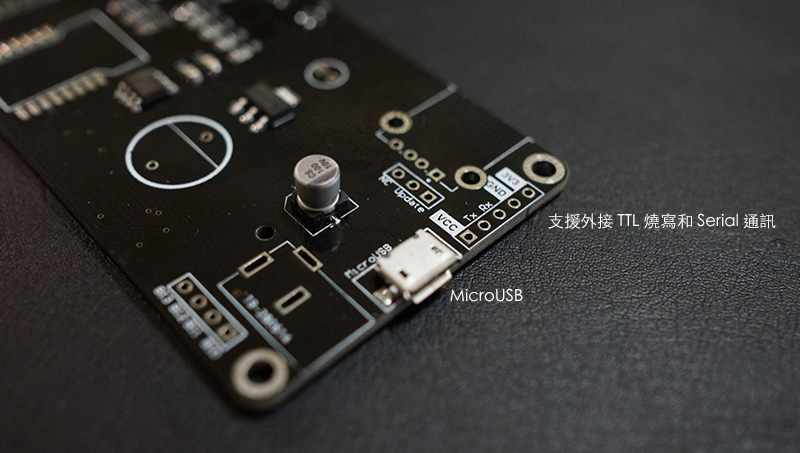
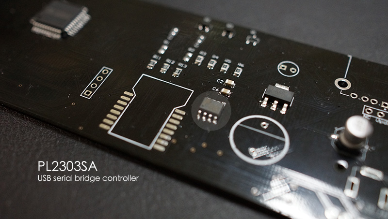
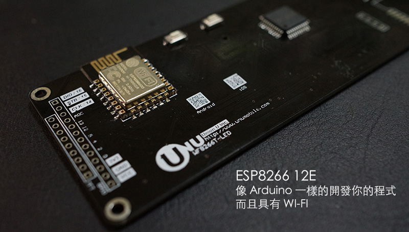

#WF8266T-DEV
2015年在物聯網 Internet of thing(IoT) 應用領域中ESP8266 真是一匹黑馬，整個市場和團隊的發展，無不給人一種耳目一新的體驗。加上 Arduino IDE 的開發整合，將原本就在使用 Arduino 的族群以無痛移植的方式，不需改任何程式和開發習性下，直接將原本運行在 Arduino 的程式，直接可以燒寫在 ESP8266下執行。
##開發板介紹
WF8266T-DEV 開發板是由通聯行動創意科技研發製造的開發板，支援 2 組 TTL 界面，可選擇外接 TTL 燒寫及通訊，或是使用 MicroUSB 直接開發。

USB TTL 晶片採用穩定性較高的 PL2003SA 晶片，相對的成本也增加許多。支援 Windows 版 Arduino IDE 直接燒寫，但在 Mac OS X Yosemite 目前只支援序列通訊，無法直接用 Arduino IDE 寫入。 需另外透過指令燒寫。

核心晶片 ESP8266 12E 封裝，內建 4 MBytes 空間，中大型應用也都沒問題。

為了讓開發板和實用性取得一個平衡，我們將顯示屏和 ESP8266 整合，讓機器也能輕易和外界溝通，並且任何和數字或點陣有關的應用都能在一片板子中完成。其中支援了 7 位數的 8 段顯示，5位數顯示＋6X7點陣，可放一個圖示。

另外，開發板中引出了以下腳位

