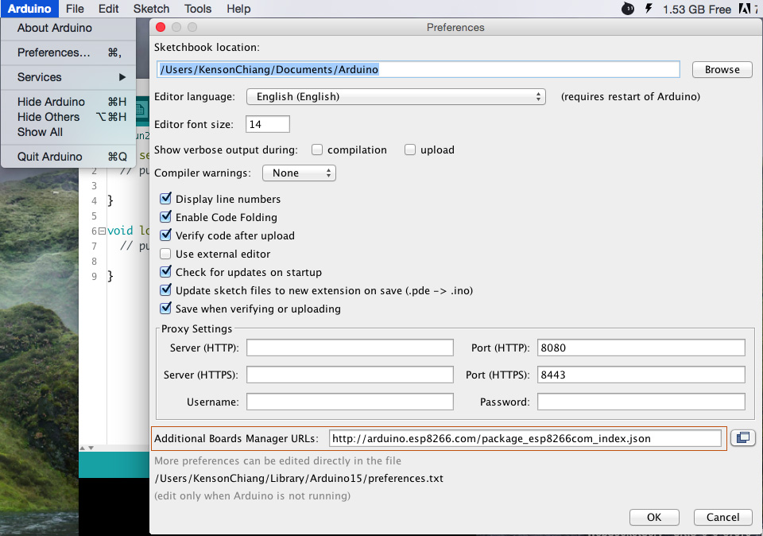
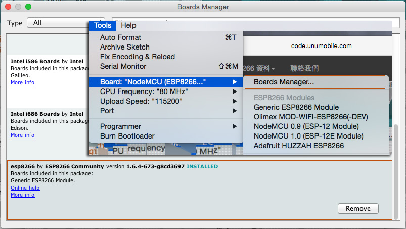
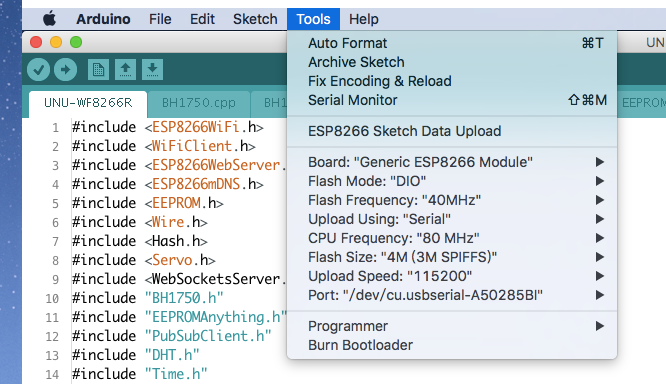

#開發環境準備
##Arduino IDE
開發工具 : Arduino IDE 請到 [Arduino.cc](https://www.arduino.cc/en/Main/Software) 官網下載適合的版本.

##ESP8266 Arduino 開發板套件
這裡要介紹的方法是使用 Arduino IDE 來開發 WF8266R 也就是 ESP8266 的晶片, 以下將以 Mac 系統示範, 其它平台都是相同的概念.

###加入開發板
請打開 Arduino IDE 的設定, 找到 Additional Boards Manager URLs 將 ESP8266 的開發板套件位址 http://arduino.esp8266.com/package_esp8266com_index.json 填入.

###更新開發板
在 Tools 選單中點擊 Boards Manager, 當你打開時就會自動更新, 再檢查看看 ESP8266 是否安裝成功. 如果成功你應該會看到如下畫面可以選擇 Board 是哪一種, CPU 和 上傳速度等等設定.

相關參數設置請參考下圖
