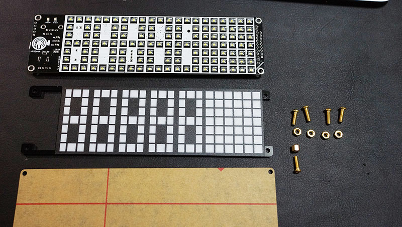
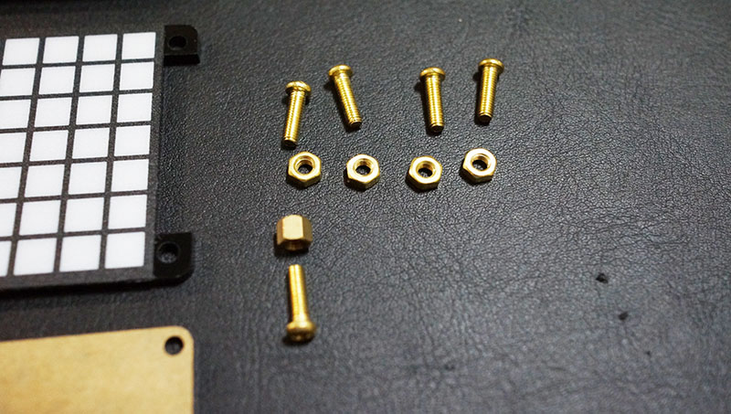
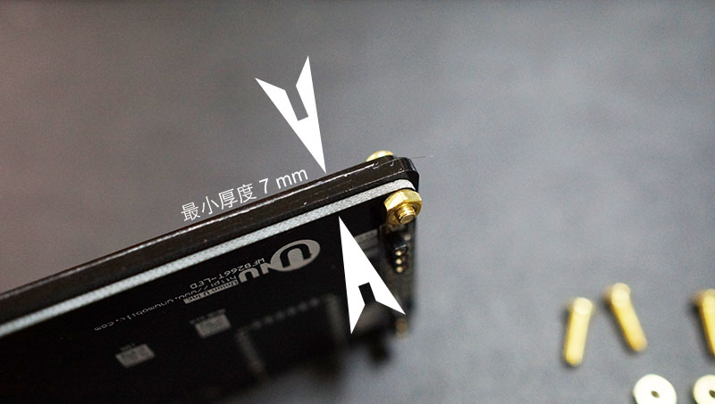
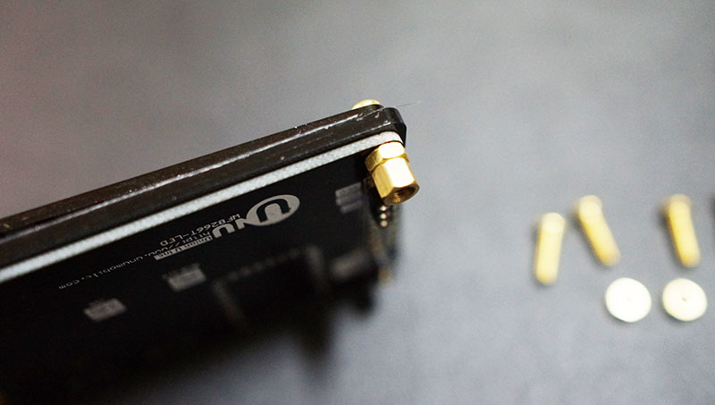
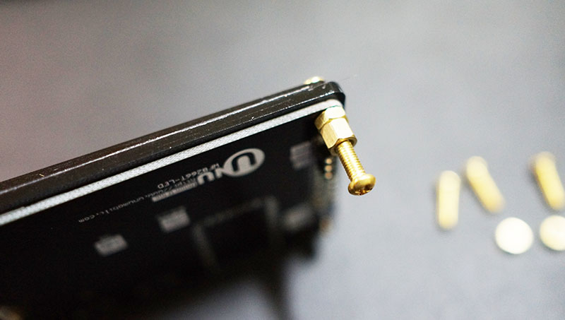
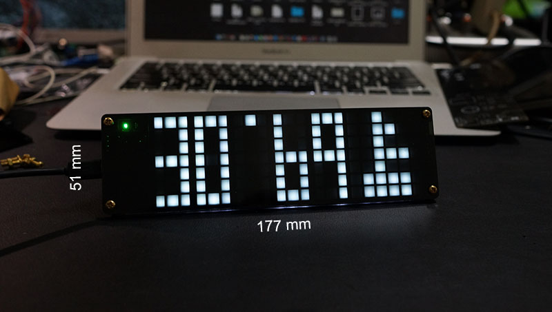

#套件清單和組裝
* 開發板
* LED 聚光層
* 鏡面質感濾光層
* 固定螺絲 M3*5
* 螺帽 M2*4
* 螺帽 M4*1
* Micro USB 線

#四腳鎖定
首先請將濾光層雙面的保護膠取下，然後將4個螺絲插入四個角落圓孔，並鎖上螺帽。

#單腳支撐
如果有需要立在平面上時，可將左或右鎖上支撐螺絲

#產品規格
* 長 177 mm x 高 51 mm x 厚 7 mm ~ 10 mm
* 核心晶片 ESP8266
* 應用服務 WF8266R
* Micro USB
* USB 晶片 PL2303SA (選配)
* 溫濕度 DHT11(選配)
* 感光器 (選配)
* 喇叭 (選配)
* 夜燈 (選配)
* BLE 4.0 iBeacon (選配)
* 0805 貼片式 白光 藍光 綠光 紅光 LED 高亮 和 超亮 (白光)
* 工作電壓 5V
* 全亮時最大電流 200 ~ 300 mA
 

#驅動程式

PL2303SA
http://prolificusa.com/portfolio/pl2303sa-usb-serial-bridge-controller/