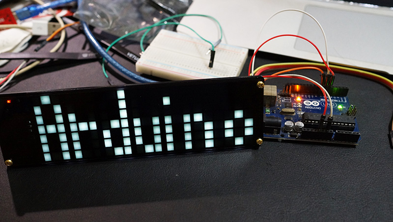
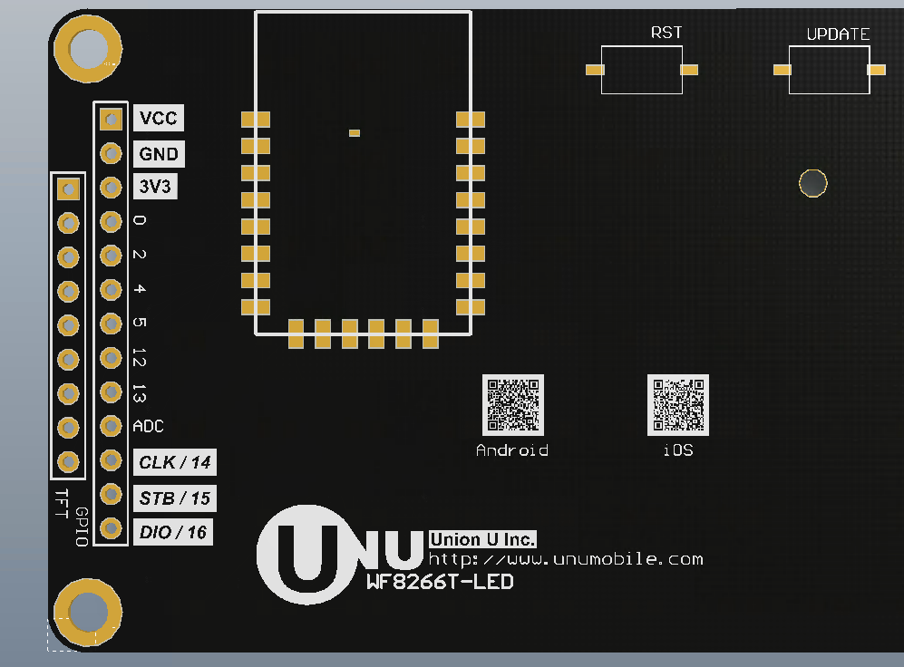
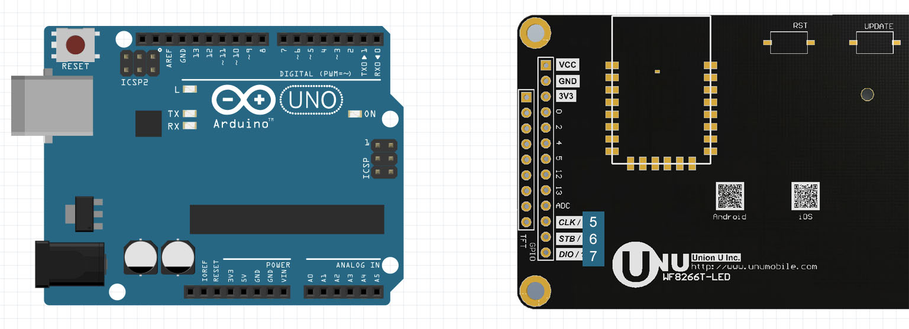
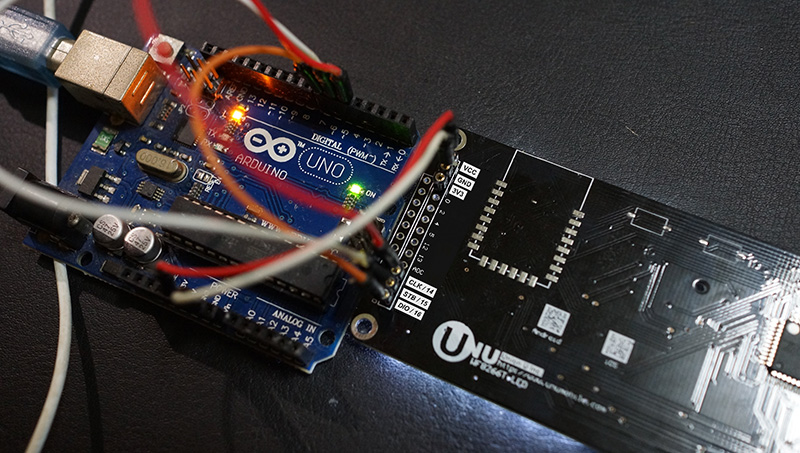
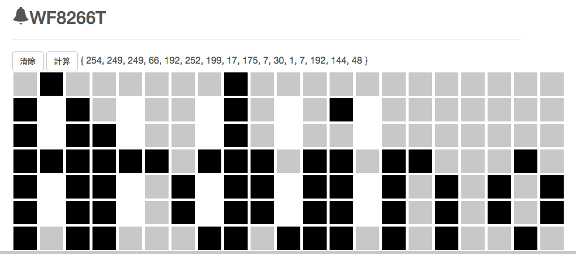

# WF8266T-LED 開發板介紹

WF8266T-LED 是顯示模組，可提供給所有MCU 系統只需使用 3個數位腳位輸出就可以控制128顆 LED 的顯示。

## 特色
* 使用 3 個 IO 即可控制 LED 點陣
* 可控制 8 級亮度
* 除了 電源 IO 外，內建 Micro USB 可轉換 5V 和 3V3 電源
* 視覺化的編碼界面，想顯示什麼點一點即可產生代碼
* 耐高溫設計 可在車上使用高溫不變型
* 7 位數 7段數字顯示
* 一組 6X7 點陣顯示
* 支援任何 MCU 只要能使用 數位輸出 即可。 ARDUINO, 8051, ESP8266, STM 等等

## 應用方向
* 數位時鐘
* 計數器
* 叫號顯示
* 任何和數字顯示有關的應用，右側可自訂 6X7 點陣 ICON
* 等待你發現更多應用

## 產品規格
* 長 177 mm x 高 51 mm x 厚 7 mm ~ 10 mm
* 0805 貼片式 白光 藍光 綠光 紅光 LED 高亮 和 超亮白光
* 130 顆 LED

## 接線
在 WF8266T-LED 腳位中可看到如下圖所示，除了 VCC 接 Arduino 5V, GND 接 Arduino GND外，尚需要3個IO腳位。這個範例是使用了腳位 5 6 7, 分別是接到 CLK STB DIO。

如果覺得 Arduino 電流輸出不夠，亮度不高時，可再插上 MicroUSB, 但記得一定要共地，也就是 原本 VCC 和 GND 一樣要插上，如果沒接會造成電流過大發熱，請注意。

## 取得編碼
我們需要將要顯示的資料透過剛才3個腳位送到 WF8266T-LED 中，因此請到 http://wf8266.com/wf8266r/led/display 進行顯示編碼計算。 例如我們想顯示 Arduino 字樣在顯示器上，按下計算後會得到

{ 254, 249, 249, 66, 192, 252, 199, 17, 175, 7, 30, 1, 7, 192, 144, 48 }

這樣的一串數例，這便是顯示的編碼，接下來將其填到 範例程式中 fullBuffer 陣列中就可以了。

下載完整範例 ： https://github.com/UNUMobile/wf8266t