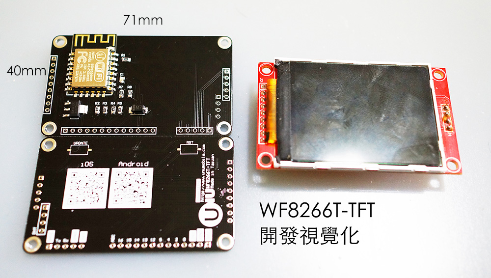

# WF8266T-TFT 開發板介紹

## 預設電路
因為 TFT 驅動需要 SPI 的腳位，因此尚有以下 ＊ GPIO0 GPIO1 GPIO2 GPIO3 GPIO5 GPIO12 這6個腳位可自訂控制使用。

* *GPIO0 : UPDATE(紅色按鍵), DHT11(DATA) / DHT22(DATA)
* *GPIO1 : Tx
* *GPIO2 : None
* *GPIO3 : Rx
* GPIO4 : SD Card CS
* *GPIO5 : None
* *GPIO12: MISO(None)
* GPIO13: MOSI
* GPIO14: SCK
* GPIO15: CS
* GPIO16: LED