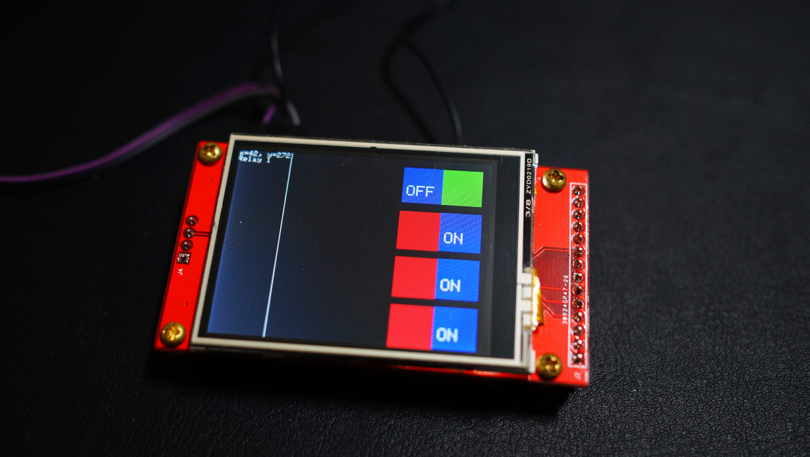

# WF8266T-Touch 開發板介紹

## 預設電路
因為 TFT 和 Touch 驅動需要 SPI 的腳位，我們已預先定義了以下腳位功能，其中除了 GPIO14 GPIO16 會影響到 TFT 顯示外，其它的腳位可依實際情況評估使用。

* GPIO0 : UPDATE(紅色按鍵), T_CLK
* GPIO1 : Tx, T_DOUT
* GPIO2 : T_CS
* GPIO3 : T_IRQ
* GPIO4 : SD Card CS
* GPIO5 : D/C
* GPIO12: MISO(None)
* GPIO13: MOSI
* GPIO14: SCK
* GPIO15: CS
* GPIO16: LED
* ADC : None