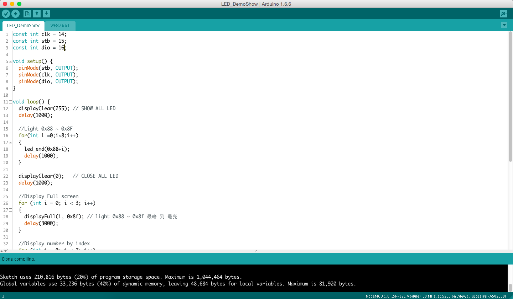

#點亮 LED 屏
WF8266T 是 WF8266R 的顯示單元，提供給 WF8266R 顯示訊息或聲音給使用者。 WF8266T-LED 是顯示模組，可提供給所有MCU 系統只需使用 3個數位腳位輸出就可以控制128顆 LED 的顯示。

##取得編碼
我們需要將要顯示的資料透過剛才3個腳位送到 WF8266T-LED 中，因此請到 http://code.unumobile.com/wf8266r/led/display 進行顯示編碼計算。 例如我們想顯示 Arduino 字樣在顯示器上，按下計算後會得到

{ 254, 249, 249, 66, 192, 252, 199, 17, 175, 7, 30, 1, 7, 192, 144, 48 }

這樣的一串數例，這便是顯示的編碼，接下來將其填到 範例程式中 fullBuffer 陣列中就可以了。

原始碼 ： https://github.com/UNUMobile/wf8266t/tree/master/WF8266T-LED/Sample/ESP8266/LED_DemoShow

請開啟 LED_DemoShow.ino 並燒寫到 ESP8266 看看是否能看到顯示

